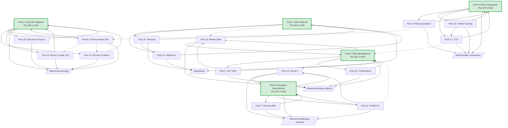

# Internal Link Graph — Pillar-Cluster Architecture

> **Purpose**: every blog post must link to its pillar hub + sibling posts + relevant landing pages. Goal = no orphans, strong topical authority, user journey from TOFU content to MOFU/BOFU landing pages.
>
> **Model**: hub-and-spoke per pillar. Each of the 5 pillars gets a pillar page (the strongest post in the cluster acts as the hub until we build dedicated pillar pages in post-MVP stage). Spokes = supporting posts. Cross-cluster links where topics overlap (e.g., nearshoring ↔ china+1).
>
> **Orphan rule**: every post must have **at least 3 incoming internal links** from either landing pages, pillar hub, or sibling posts. No exceptions.
>
> **Anchor text rule**: always descriptive, contains KW variant, never "click here" / "learn more". Mix exact-match and partial-match to avoid over-optimization.
>
> **Placement rule**: links are **in-text (contextual)**, not just "further reading" blocks at the bottom. At minimum 3 contextual links per post, max 8 (density around 1 link per 300 words).

---

## 5 Pillars & Their Hubs

| Pillar | Hub post (acting as pillar page) | Spoke posts | Pillar landing page (post-MVP) |
|---|---|---|---|
| **1. AI Sourcing Automation** | Post 1 — How to Find 100+ Verified Suppliers | Posts 6, 10, 18, 20 | `/features/ai-sourcing` (existing) |
| **2. ERP/CRM Integration** | Post 5 — SAP Ariba Alternative + S/4HANA Sync | Posts 16, 19 | `/integrations` (hub, existing) |
| **3. Multilingual Supplier Outreach** | Post 3 — European Nearshoring Guide 2026 | Posts 7, 11, 14 | `/features/multilingual-outreach` (existing) |
| **4. Supplier Intelligence & Compliance** | Post 9 — Supplier Risk Management 2026 Checklist | Posts 4, 12, 13 | `/features/company-registry` or new `/solutions/compliance` |
| **5. Offer Comparison & Negotiation** | Post 8 — RFQ Comparison Template | Posts 2, 15, 17 | `/features/offer-comparison` (existing) |

---

## Per-Post Link Specification

Each row specifies: outbound links **from** the post to other posts / landing pages + expected inbound links (which posts and landing pages will link back).

### Post 1 — how-to-find-100-verified-suppliers (Pillar 1 hub)

**Outbound links (7):**
| Target | Anchor text | Section |
|---|---|---|
| Post 10 (30-hour problem) | "the real cost of manual sourcing" | H2.1 "The 30-hour problem…" |
| Post 4 (VAT VIES) | "VAT VIES verification" | H2.2 "What counts as verified" |
| Post 12 (certifications) | "which supplier certifications matter" | H2.2 |
| Post 18 (discovery process) | "step-by-step supplier discovery process" | H2.4 |
| Post 20 (buyer's guide) | "12 questions to ask any AI sourcing tool" | H2.7 (worked example) |
| `/features/ai-sourcing` | "Procurea's AI sourcing feature" | H2.4 |
| Lead magnet: `/resources/supplier-verification-checklist` | "free supplier verification checklist" | H2.5 CTA |

**Expected inbound (5):**
- Post 10 (30-hour problem) → this post as "how to actually solve the 30-hour problem"
- Post 18 (discovery process) → this post as cluster hub
- Post 20 (buyer's guide) → this post as "see it in action"
- Post 6 (AI procurement software) → this post from feature 1 section
- `/features/ai-sourcing` landing page → contextual link from value-prop copy

---

### Post 2 — rfq-automation (Pillar 5 spoke)

**Outbound links (6):**
| Target | Anchor text | Section |
|---|---|---|
| Post 8 (RFQ comparison template) | "free RFQ comparison template" | H2.6, H2.8 FAQ |
| Post 15 (vendor scoring) | "10-criteria vendor scoring framework" | H2.5 |
| Post 17 (TCO) | "total cost of ownership beats purchase price" | H2.5 |
| `/features/email-outreach` | "automated RFQ outreach" | H2.4 |
| `/features/offer-comparison` | "side-by-side offer comparison" | H2.4 |
| `/industries/manufacturing` | "RFQ automation for manufacturers" | H2.5 |

**Expected inbound (4):**
- Post 8 (comparison template) → "before you compare, automate sending"
- Post 10 (30-hour problem) → "where automation saves time"
- Post 6 (AI procurement software) → feature 7 (automated comparison)
- `/features/email-outreach` landing → contextual link

---

### Post 3 — european-nearshoring (Pillar 3 hub)

**Outbound links (8):**
| Target | Anchor text | Section |
|---|---|---|
| Post 14 (china+1) | "the 6-week China+1 migration playbook" | H2.6 |
| Post 11 (textile sourcing) | "Turkey vs Poland vs Portugal for textile sourcing" | H2.3 |
| Post 7 (German manufacturers) | "how to source from German manufacturers" | H2.3 |
| Post 9 (risk management) | "supplier risk management with CSDDD" | H2.7 |
| Post 12 (certifications) | "certifications required for EU imports" | H2.7 |
| `/use-cases/china-to-nearshore` | "China-to-nearshore migration use case" | H2.6 |
| `/industries/retail-ecommerce` | "private label nearshoring for D2C brands" | H2.5 |
| Lead magnet: `/resources/nearshoring-playbook` | "the 40-page nearshoring playbook" | H2.6 CTA |

**Expected inbound (5):**
- Post 14 (china+1) → this post as cluster hub
- Post 11 (textile) → this post as cluster context
- Post 7 (German) → this post as regional overview
- `/use-cases/china-to-nearshore` → contextual link
- `/industries/manufacturing` → contextual link

---

### Post 4 — vat-vies-verification (Pillar 4 spoke)

**Outbound links (5):**
| Target | Anchor text | Section |
|---|---|---|
| Post 9 (risk management) | "supplier risk management checklist" | H2.1 |
| Post 13 (master data quality) | "how supplier data decays over time" | H2.5 |
| Post 1 (how to find suppliers) | "finding verified suppliers in under an hour" | H2.1 |
| `/features/company-registry` | "Procurea's automated VAT & registry verification" | H2.6 |
| `/integrations` | "integrate verification into your ERP flow" | H2.6 |

**Expected inbound (5):**
- Post 1 → "VAT VIES verification" in verification H2
- Post 9 → "validate VAT numbers" in risk checklist
- Post 13 → "dormant VAT as a decay signal"
- Post 12 (certifications) → cross-reference
- `/features/company-registry` landing → contextual

---

### Post 5 — sap-ariba-alternative-s4hana-sourcing (Pillar 2 hub)

**Outbound links (7):**
| Target | Anchor text | Section |
|---|---|---|
| Post 16 (NetSuite) | "NetSuite supplier management integration" | H2.5 (comparison) |
| Post 19 (Salesforce) | "Salesforce for procurement architecture" | H2.5 |
| Post 13 (master data quality) | "the 40% supplier data decay problem" | H2.7 |
| Post 6 (AI procurement software) | "AI procurement software features worth paying for" | H2.5 |
| `/integrations/sap` | "SAP integration details" | H2.4 |
| `/integrations` | "Procurea's ERP integrations hub" | H2.4 |
| `/pricing` | "Procurea pricing — mid-market friendly" | H2.1 |

**Expected inbound (4):**
- Post 16 (NetSuite) → cross-cluster ERP comparison
- Post 19 (Salesforce) → cross-cluster ERP comparison
- `/integrations/sap` landing → from feature copy
- `/industries/manufacturing` → contextual (manufacturing often on SAP)

---

### Post 6 — ai-procurement-software (Pillar 1 spoke)

**Outbound links (8):**
| Target | Anchor text | Section |
|---|---|---|
| Post 1 (how to find suppliers) | "how AI actually finds suppliers" | H2.2 (feature 1) |
| Post 20 (buyer's guide) | "12 questions to ask before you sign" | H2.10 |
| Post 9 (risk management) | "live supplier risk signals" | H2.4 (feature 3) |
| Post 10 (30-hour problem) | "the 30-hour sourcing problem" | H2.1 |
| Post 18 (discovery process) | "supplier discovery process explained" | H2.2 |
| `/features/ai-sourcing` | "Procurea's AI supplier sourcing" | H2.2 |
| `/pricing` | "Procurea pricing" | H2.10 |
| `/features/multilingual-outreach` | "multilingual AI outreach" | H2.7 |

**Expected inbound (4):**
- Post 1 → "AI procurement software features"
- Post 20 → "features worth paying for"
- Post 5 (SAP alternative) → "AI procurement features"
- `/features/ai-sourcing` landing → contextual

---

### Post 7 — german-manufacturer-sourcing (Pillar 3 spoke)

**Outbound links (6):**
| Target | Anchor text | Section |
|---|---|---|
| Post 3 (European nearshoring) | "European nearshoring guide 2026" | H2.1 |
| Post 11 (textile sourcing) | "Turkey vs Poland vs Portugal" | H2.8 |
| Post 12 (certifications) | "ISO 9001 vs IATF 16949" | H2.6 |
| Post 4 (VAT VIES) | "verify German VAT (DE prefix) on VIES" | H2.3 |
| `/features/multilingual-outreach` | "multilingual outreach in German" | H2.5 |
| `/industries/manufacturing` | "industrial sourcing for manufacturers" | H2.1 |

**Expected inbound (4):**
- Post 3 (nearshoring) → country-specific deep dive
- Post 11 (textile) → cross-reference (Germany for technical fabrics)
- Post 14 (china+1) → Germany as a +1 option
- `/features/multilingual-outreach` → contextual

---

### Post 8 — rfq-comparison-template (Pillar 5 hub)

**Outbound links (7):**
| Target | Anchor text | Section |
|---|---|---|
| Post 2 (RFQ automation) | "why Excel breaks past 10 suppliers" | H2.7 |
| Post 15 (vendor scoring) | "10-criteria vendor scoring framework" | H2.3 |
| Post 17 (TCO) | "total cost of ownership beats purchase price" | H2.5 |
| Post 1 (how to find suppliers) | "before you compare, find 100 suppliers" | H2.1 |
| `/features/offer-comparison` | "Procurea's offer comparison feature" | H2.7 |
| `/features/email-outreach` | "automated RFQ outreach" | H2.7 |
| Lead magnet: `/resources/rfq-comparison-template` | "download the template" | H2.2 CTA |

**Expected inbound (5):**
- Post 2 (RFQ automation) → link to comparison template
- Post 15 (vendor scoring) → cluster sibling
- Post 17 (TCO) → cluster sibling
- Post 10 (30-hour problem) → "comparison eats 4 hours"
- `/features/offer-comparison` landing → contextual

---

### Post 9 — supplier-risk-management (Pillar 4 hub)

**Outbound links (8):**
| Target | Anchor text | Section |
|---|---|---|
| Post 4 (VAT VIES) | "3-minute VAT VIES verification" | H2.6 (checklist item) |
| Post 12 (certifications) | "how to verify supplier certifications" | H2.6 |
| Post 13 (master data quality) | "supplier data decay audit" | H2.4 |
| Post 14 (china+1) | "China+1 as a risk-mitigation strategy" | H2.1 |
| Post 15 (vendor scoring) | "vendor scoring framework" | H2.4 |
| `/features/company-registry` | "automated registry + sanctions screening" | H2.7 |
| `/industries/healthcare` | "risk management for healthcare procurement" | H2.5 |
| Lead magnet: `/resources/supplier-risk-checklist` | "download the 20-point checklist" | H2.6 CTA |

**Expected inbound (5):**
- Post 4 (VAT VIES) → risk context
- Post 12 (certifications) → risk context
- Post 13 (master data) → risk context
- Post 3 (nearshoring) → CSDDD cross-ref
- `/features/company-registry` landing → contextual

---

### Post 10 — procurement-efficiency (Pillar 1 spoke)

**Outbound links (7):**
| Target | Anchor text | Section |
|---|---|---|
| Post 1 (how to find suppliers) | "find 100 suppliers in under an hour" | H2.5 |
| Post 2 (RFQ automation) | "RFQ automation replaces 14 hours of work" | H2.5 |
| Post 8 (comparison template) | "RFQ comparison template" | H2.5 |
| Post 18 (discovery process) | "supplier discovery process" | H2.3 |
| Post 6 (AI procurement software) | "AI procurement software features worth paying for" | H2.5 |
| `/features/ai-sourcing` | "AI sourcing that cuts 30h to 1h" | H2.5 |
| Lead magnet: `/resources/sourcing-cost-calculator` | "free sourcing cost calculator" | H2.7 CTA |

**Expected inbound (6):**
- Post 1 → from 30-hour problem H2
- Post 2 → from Excel-breaks H2
- Post 6 → from state-of-AI H2
- Post 15 → from scorecard-to-KPIs H2
- Post 18 → from process-time H2
- `/` home page → contextual link from value prop copy

---

### Post 11 — textile-sourcing-europe (Pillar 3 spoke)

**Outbound links (6):**
| Target | Anchor text | Section |
|---|---|---|
| Post 3 (European nearshoring) | "European nearshoring guide 2026" | H2.1 |
| Post 14 (china+1) | "China+1 playbook" | H2.1 |
| Post 7 (German manufacturers) | "German manufacturer sourcing" | H2.6 |
| Post 12 (certifications) | "OEKO-TEX & GOTS explained" | H2.2 |
| `/industries/retail-ecommerce` | "private label retail sourcing" | H2.7 |
| `/features/multilingual-outreach` | "RFQs in Turkish, Polish, Portuguese" | H2.8 |

**Expected inbound (4):**
- Post 3 (nearshoring) → country comparison
- Post 14 (china+1) → country comparison
- Post 7 (German) → cross-reference
- `/industries/retail-ecommerce` → contextual

---

### Post 12 — supplier-certifications-guide (Pillar 4 spoke)

**Outbound links (6):**
| Target | Anchor text | Section |
|---|---|---|
| Post 9 (risk management) | "supplier risk checklist including certifications" | H2.9 |
| Post 4 (VAT VIES) | "legal entity verification" | H2.8 |
| Post 7 (German manufacturers) | "German DIN standards reference" | H2.2 |
| `/features/company-registry` | "certification verification at scale" | H2.8 |
| `/industries/healthcare` | "healthcare-specific certifications" | H2.4 |
| `/industries/manufacturing` | "automotive IATF 16949 sourcing" | H2.3 |

**Expected inbound (5):**
- Post 1 → verification H2
- Post 7 → German certifications
- Post 9 → risk checklist
- Post 11 → OEKO-TEX/GOTS
- `/features/company-registry` → contextual

---

### Post 13 — supplier-master-data-quality (Pillar 4 spoke)

**Outbound links (6):**
| Target | Anchor text | Section |
|---|---|---|
| Post 9 (risk management) | "supplier risk management checklist" | H2.7 |
| Post 4 (VAT VIES) | "VAT number revocation as a decay signal" | H2.2 |
| Post 5 (SAP alternative) | "SAP supplier master integration" | H2.7 |
| Post 16 (NetSuite) | "NetSuite vendor record management" | H2.7 |
| `/features/company-registry` | "automated supplier data enrichment" | H2.6 |
| `/integrations` | "keep supplier data in sync across ERPs" | H2.7 |

**Expected inbound (4):**
- Post 4 (VAT VIES) → decay signal cross-ref
- Post 5 (SAP) → master data section
- Post 9 (risk) → risk context
- `/features/company-registry` → contextual

---

### Post 14 — china-plus-1-sourcing (Pillar 3 spoke)

**Outbound links (7):**
| Target | Anchor text | Section |
|---|---|---|
| Post 3 (European nearshoring) | "European nearshoring guide 2026" | H2.6 |
| Post 11 (textile sourcing) | "Turkey vs Poland vs Portugal textile comparison" | H2.3 |
| Post 7 (German manufacturers) | "sourcing from Germany as a +1" | H2.3 |
| Post 9 (risk management) | "supplier risk management in +1 transitions" | H2.7 |
| `/use-cases/china-to-nearshore` | "China-to-nearshore migration use case" | H2.5 |
| `/features/multilingual-outreach` | "multilingual outreach across 5 countries" | H2.5 |
| Lead magnet: `/resources/nearshoring-playbook` | "download the 40-page playbook" | H2.5 CTA |

**Expected inbound (4):**
- Post 3 (nearshoring) → playbook link
- Post 11 (textile) → cluster cross-ref
- `/use-cases/china-to-nearshore` → contextual
- `/industries/retail-ecommerce` → contextual

---

### Post 15 — vendor-scoring-framework (Pillar 5 spoke)

**Outbound links (6):**
| Target | Anchor text | Section |
|---|---|---|
| Post 8 (comparison template) | "RFQ comparison template" | H2.6 |
| Post 17 (TCO) | "TCO-weighted scoring" | H2.2 |
| Post 9 (risk management) | "risk-first scorecard weighting" | H2.3 |
| Post 10 (30-hour problem) | "how scoring fits the sourcing workflow" | H2.7 |
| `/features/offer-comparison` | "Procurea's weighted scoring feature" | H2.3 |
| Lead magnet: `/resources/vendor-scorecard-template` | "download the scorecard" | H2.3 CTA |

**Expected inbound (5):**
- Post 2 (RFQ automation) → framework link
- Post 8 (comparison template) → cluster sibling
- Post 9 (risk) → weighting cross-ref
- Post 17 (TCO) → scoring integration
- `/features/offer-comparison` → contextual

---

### Post 16 — netsuite-supplier-management (Pillar 2 spoke)

**Outbound links (6):**
| Target | Anchor text | Section |
|---|---|---|
| Post 5 (SAP alternative) | "SAP Ariba alternative for mid-market" | H2.5 |
| Post 19 (Salesforce) | "Salesforce for procurement architecture" | H2.5 |
| Post 13 (master data quality) | "supplier master data decay" | H2.3 |
| Post 6 (AI procurement software) | "AI procurement software features" | H2.2 |
| `/integrations/oracle-netsuite` | "Procurea + NetSuite integration" | H2.5 |
| `/features/ai-sourcing` | "AI-powered supplier discovery" | H2.2 |

**Expected inbound (3):**
- Post 5 (SAP alternative) → ERP comparison
- Post 13 (master data) → ERP context
- `/integrations/oracle-netsuite` → contextual

---

### Post 17 — tco-procurement (Pillar 5 spoke)

**Outbound links (6):**
| Target | Anchor text | Section |
|---|---|---|
| Post 8 (comparison template) | "RFQ comparison template" | H2.7 |
| Post 15 (vendor scoring) | "vendor scoring framework" | H2.7 |
| Post 2 (RFQ automation) | "RFQ automation" | H2.7 |
| Post 10 (30-hour problem) | "sourcing campaign cost math" | H2.1 |
| `/features/offer-comparison` | "Procurea's TCO-aware comparison" | H2.7 |
| Lead magnet: `/resources/tco-calculator` | "download the TCO calculator" | H2.5 CTA |

**Expected inbound (4):**
- Post 2 (RFQ automation) → TCO cross-ref
- Post 8 (comparison template) → cluster sibling
- Post 15 (vendor scoring) → cluster sibling
- `/features/offer-comparison` → contextual

---

### Post 18 — supplier-discovery-process (Pillar 1 spoke)

**Outbound links (7):**
| Target | Anchor text | Section |
|---|---|---|
| Post 1 (how to find suppliers) | "how to find 100+ verified suppliers in under an hour" | H2.4 |
| Post 10 (30-hour problem) | "where the 30 hours actually go" | H2.8 |
| Post 6 (AI procurement software) | "AI procurement software features" | H2.3 |
| Post 20 (buyer's guide) | "12 questions to ask" | H2.3 |
| Post 4 (VAT VIES) | "verify VAT in 3 minutes" | H2.5 |
| `/features/ai-sourcing` | "Procurea's AI sourcing workflow" | H2.4 |
| `/features/contact-enrichment` | "supplier contact enrichment" | H2.5 |

**Expected inbound (4):**
- Post 1 → "step-by-step supplier discovery process"
- Post 6 → "supplier discovery process explained"
- Post 10 → "process time"
- `/features/ai-sourcing` → contextual

---

### Post 19 — salesforce-for-procurement (Pillar 2 spoke)

**Outbound links (6):**
| Target | Anchor text | Section |
|---|---|---|
| Post 5 (SAP alternative) | "SAP Ariba alternative" | H2.5 (cross-cluster) |
| Post 16 (NetSuite) | "NetSuite procurement landscape" | H2.5 |
| Post 13 (master data quality) | "supplier master-of-record decisions" | H2.6 |
| Post 2 (RFQ automation) | "RFQ automation tool integrations" | H2.3 |
| `/integrations/salesforce` | "Procurea + Salesforce integration" | H2.7 |
| `/integrations` | "Procurea integrations hub" | H2.5 |

**Expected inbound (3):**
- Post 5 (SAP) → ERP comparison
- Post 16 (NetSuite) → ERP comparison
- `/integrations/salesforce` → contextual

---

### Post 20 — ai-sourcing-tool-comparison (Pillar 1 spoke)

**Outbound links (7):**
| Target | Anchor text | Section |
|---|---|---|
| Post 6 (AI procurement software) | "7 AI procurement features worth paying for" | H2.1 |
| Post 1 (how to find suppliers) | "how to find 100 verified suppliers in under an hour" | H2.9 |
| Post 18 (discovery process) | "supplier discovery process" | H2.2 |
| Post 10 (30-hour problem) | "30-hour problem breakdown" | H2.7 |
| Post 5 (SAP alternative) | "ERP integration for sourcing" | H2.4 |
| `/pricing` | "Procurea pricing (transparent)" | H2.6 |
| `/features/ai-sourcing` | "see Procurea's AI sourcing in action" | H2.9 |

**Expected inbound (4):**
- Post 1 → buyer's guide reference
- Post 6 → "how to evaluate"
- Post 18 → process comparison
- `/features/ai-sourcing` → contextual

---

## Cross-Cluster Bridges

Some posts connect two pillars. Explicit cross-cluster links prevent silo formation:

| Bridge | From pillar | To pillar | Link rationale |
|---|---|---|---|
| Post 5 ↔ Post 13 | ERP Integration | Supplier Intelligence | SAP master data + data quality |
| Post 9 ↔ Post 14 | Compliance | Multilingual | CSDDD applies to nearshoring |
| Post 6 ↔ Post 20 | AI Sourcing | AI Sourcing | Features guide ↔ Buyer's guide (same cluster, different intent) |
| Post 2 ↔ Post 6 | Offer Comparison | AI Sourcing | RFQ automation is an AI feature |
| Post 17 ↔ Post 9 | Offer Comparison | Compliance | TCO includes compliance cost |
| Post 11 ↔ Post 9 | Multilingual | Compliance | Textile sourcing needs OEKO-TEX/GOTS |

---

## Link Graph (Mermaid)

---

## Anchor Text Diversity Rules

To avoid over-optimization flags:

| Anchor type | % of total anchors | Example |
|---|---|---|
| Exact match (PKW only) | ≤ 15% | "supplier risk management" |
| Partial match | 40-50% | "supplier risk management checklist" |
| Branded | 10-15% | "Procurea's AI sourcing feature" |
| Descriptive / contextual | 30-40% | "the 6-week migration playbook" |
| Naked URL | ≤ 5% | `procurea.io/features/ai-sourcing` |

Rule of thumb per post: no more than 2 outbound links with the exact same anchor phrase.

---

## Landing Page Reverse Linking

Feature and industry landing pages should link **into** the blog (not just receive links). This boosts blog post crawl priority.

| Landing page | Contextual blog links from copy |
|---|---|
| `/features/ai-sourcing` | Post 1, Post 6, Post 18 |
| `/features/offer-comparison` | Post 8, Post 15, Post 17 |
| `/features/email-outreach` | Post 2, Post 8 |
| `/features/multilingual-outreach` | Post 3, Post 11, Post 14 |
| `/features/company-registry` | Post 4, Post 9, Post 12, Post 13 |
| `/integrations` | Post 5, Post 16, Post 19 |
| `/integrations/sap` | Post 5 |
| `/integrations/oracle-netsuite` | Post 16 |
| `/integrations/salesforce` | Post 19 |
| `/industries/manufacturing` | Post 2, Post 7, Post 12 |
| `/industries/retail-ecommerce` | Post 3, Post 11, Post 14 |
| `/use-cases/china-to-nearshore` | Post 3, Post 14 |

These must be **in-body** mentions, not just a sidebar "related articles" widget.

---

## Orphan Check — Every Post Has ≥3 Inbound

| Post | Inbound count | Status |
|---|---|---|
| Post 1 | 5 | OK |
| Post 2 | 4 | OK |
| Post 3 | 5 | OK |
| Post 4 | 5 | OK |
| Post 5 | 4 | OK |
| Post 6 | 4 | OK |
| Post 7 | 4 | OK |
| Post 8 | 5 | OK |
| Post 9 | 5 | OK |
| Post 10 | 6 | OK |
| Post 11 | 4 | OK |
| Post 12 | 5 | OK |
| Post 13 | 4 | OK |
| Post 14 | 4 | OK |
| Post 15 | 5 | OK |
| Post 16 | 3 | Minimum (monitor) |
| Post 17 | 4 | OK |
| Post 18 | 4 | OK |
| Post 19 | 3 | Minimum (monitor) |
| Post 20 | 4 | OK |

No orphans. Posts 16 and 19 are at the minimum threshold — monitor after publication and add inbound links from post-MVP content if needed.

---

## Implementation Notes

1. **Build automation**: expose an `internalLinks` array on each MDX frontmatter — validate at build time that all referenced slugs exist and reciprocal links are present. Add a Vite plugin `landing/scripts/validate-internal-links.mjs` (post-MVP).
2. **Redirect hygiene**: if a post slug ever changes, maintain 301 redirect; never break internal links.
3. **No-follow rule**: all internal links are `dofollow`. Reserve `nofollow` for external commercial competitor references (e.g., "Coupa's pricing page" in post 6).
4. **Lead magnet gating**: links to `/resources/*` point to gated landing pages (email capture), not direct downloads. Track conversion per source post.
